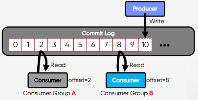
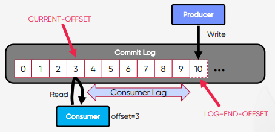
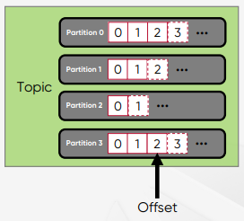

# Topic, Partition and Segment

## Apache Kafka 주요 요소
### Topic, Producer, Consumer
  
* **Topic**: Kafka 안에서 메시지가 저장되는 장소(논리적인 표현으로 눈에 보이지 않는다.)

 

## Apache Kafka Clients
### Topic, Producer, Consumer Group
* **Producer** : 메시지를 생산(Produce)해서 Kafka의 Topic으로 메시지를 보내는 애플리케이션
* **Consumer** : Topic의 메시지를 가져와서 소비(Consume)하는 애플리케이션
* **Consumer Group** : Topic의 메시지를 사용하기 위해 협력하는 Consumer들의 집합, 하나의 세트처럼 움직인다.
  * 하나의 Consumer는 하나의 Consumer Group에 반드시 포함되며, Consumer Group내의 Consumer들은 협력하여 Topic의 메시지를 분산 병렬 처리한다.
    
 

## Producer와 Consumer의 분리(Decoupling)
### Producer와 Consumer의 기본 동작 방식
* Producer와 Consumer는 서로 알지 못하며, Producer와 Consumer는 각각 고유의 속도로 Commit Log에 Write 및 Read를 수행
* 다른 Consumer Group에 속한 Consumer들은 서로 관련이 없으며, Commit Log에 있는 Event(Message)를 동시에 다른 위치에서 Read할 수 있다.

  

 

## Kafka Commit Log
### 추가만 가능하고 변경 불가능한 데이터 스트럭처
* **Commit Log** : 추가만 가능하고 변경 불가능한 데이터 스트럭처  
  데이터(Event)는 항상 로그 끝에 추가되고 변경되지 않는다.
* **Offset** : Commit Log 에서 Event의 위치 정보  
  아래 그림에서는 0 부터 10 까지의 Offset을 볼 수 있다.

  

 

## Kafka Offset
### Commit Log 에서 Event의 위치
Producer가 Write하는 **LOG-END-OFFSET**과 Consumer Group의 Consumer가 Read하고,  
처리한 후에 Commit한 **CURRENT-OFFSET**과의 차이(**Consumer Lag**)가 발생할 수 있다.

  

 

## Topic, Partition, Segment
### Logical View
* **Topic** : Kafka 안에서 메시지가 저장되는 장소, 논리적인 표현
* **Partition** : **Commit Log**, 하나의 Topic은 하나 이상의 Partition으로 구성  
  병렬처리(Throughput 향상)를 위해서 Multi Partition 사용 권장
* **Segment** : Partition은 여러개의 segment로 구성되어 있다. segment는 메시지(데이터)가 저장되는 실제 물리 File이다.  
  Segment File이 지정된 크기보다 크거나 지정된 기간보다 오래되면 새 파일이 열리고 메시지는 새 파일에 추가된다.

  .PNG)

 

## Topic, Partition, Segment
### Physical View
* **Topic 생성시 Partition 개수를 지정**하고, 각 Partition은 Broker들에 분산되며 Segment File들로 구성된다.
* Rolling Strategy : **log.segment.bytes**(default 1 GB), **log.roll.hours**(default 168 hours)

  .PNG)

 

## Active Segment
### Partition당 하나의 Active Segment
Partition당 오직 하나의 Segment가 **활성화(Active)** 되어 있다. => 데이터가 계속 쓰여지고 있는 중

 

## Summary
### Topic, Partition, Segment 의 특징

* Topic 생성시 Partition 개수를 지정  
  * 개수 변경 가능하나 운영시에는 변경 권장하지 않는다.
* Partition 번호는 0 부터 시작하고 오름차순으로 만들어 진다.
* **Topic 내의 Partition 들은 서로 독립적임(각각의 Partition이 각각의 commit log이다.)**
* Event(Message)의 위치를 나타내는 offset 이 존재한다.
* Offset은 하나의 Partition에서만 의미를 가진다.  
  * Partition 0 의 offset 1 ≠ Partition 1 의 offset 1
* Offset 값은 계속 증가하고 0 으로 돌아가지 않는다.
* Event(Message) 의 순서는 하나의 Partition내에서만 보장된다.
* Partition 에 저장된 데이터(Message)는 변경이 불가능(Immutable)하다.
* Partition 에 Write되는 데이터는 맨 끝에 추가되어 저장된다.
* Partition은 Segment File들로 구성된다.  
  * Rolling 정책 : **log.segment.bytes**(default 1 GB), **log.roll.hours**(default 168 hours)