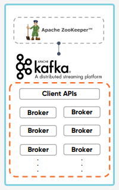

# Broker, Zookeeper and KRaft
Apache KafKa Cluster에 대한 주요 요소를 살펴보자.

정말 중요한 컴포넌트로 Broker와 Zookeeper가 있다.  
Broker는 Apache KafKa Cluster의 메인 컴포넌트 중에서도 메인으로 메시지를 수집하고 전송하는 메인 기능을 담당하고 있다.  
또 Zookeeper Ensemble이라는 컴포넌트가 있는데 이 두 컴포넌트를 중점으로 살펴보자.

 

## Kafka Broker
### Topic과 Partition을 유지 및 관리
Kafka Broker는 Partition에 대한 Read 및 Write를 관리하는 소프트웨어  

* **Kafka Server**라고 부르기도 한다.
* Topic 내의 Partition 들을 분산, 유지 및 관리
* 각각의 Broker들은 ID로 식별된다.(**단, ID는 숫자**)
* Topic의 일부 Partition들을 포함하고 있다. -> Topic 데이터의 일부분(Partition)을 갖을 뿐 데이터 전체를 갖고 있지 않는다.

* **Kafka Cluster** : 여러 개의 Broker들로 구성된다.
* Client는 특정 Broker에 연결하면 전체 클러스터에 (자동으로) 연결된다.

* **최소 3대 이상**의 Broker를 하나의 Cluster로 구성해야 한다.
  * **4대 이상을 권장**한다.(ZooKeeper mode에서)
  * Upgrade 등 작업시 Broker를 순차적으로 Shutdown시, 정상동작을 보장하기 위해서이다.
  * ZooKeeper mode가 아닌 **KRaft mode 에서는 3대 이상 권장**

 

## Kafka Broker ID 와 Partition ID 의 관계
### 아무런 관계도 없다.
Broker ID와 Partition ID 간에는 아무런 관계가 없다. -> 어느 순서에나 있을 수 있다.

* Topic을 구성하는 Partition들은 여러 Broker 상에 분산된다.
* Topic 생성시 Kafka가 자동으로 Topic을 구성하는 전체 Partition들을 모든 Broker에게 할당해주고 분배해 준다.

 

## Bootstrap Servers
### Broker Servers를 의미
모든 Kafka Broker는 Bootstrap(부트스트랩) 서버라고 부르기도 한다.
* 하나의 Broker에만 연결하면 Cluster 전체에 연결된다.
  * 하지만, 특정 Broker 장애를 대비하여, 전체 Broker List(IP, port)를 파라미터로 입력 권장 
* 각각의 Broker는 모든 Broker, Topic, Partition에 대해 알고 있다.(Metadata를 공유하기 때문)

 

## ZooKeeper
### Broker를 관리
* ZooKeeper는 Broker/Topic/Partition 들의 목록/설정/상태 등을 관리하는 소프트웨어
* ZooKeeper 없이는 Kafka가 작동할 수 없다.
  * KIP-500 을 통해서 Zookeeper 제거가 진행중
  * ZooKeeper 기반 방식을 ZooKeeper mode
  * Non-ZooKeeper 기반 방식을 KRaft mode(현재 업데이트 진행중)

* ZooKeeper는 홀수 개의 서버로 작동하게 설계되어 있음(최소 3, 권장 5)
* ZooKeeper에는 Leader(writes)가 있고 나머지 서버는 Follower(reads)

* KIP : Kafka Improvement Proposal

 

## ZooKeeper 아키텍처
### Leader/Follower 기반 Master/Slave 아키텍처
ZooKeeper는 분산형 Configuration 정보 유지, 분산 동기화 서비스를 제공하고 대용량 분산  
시스템을 위한 네이밍 레지스트리를 제공하는 소프트웨어  

분산 작업을 제어하기 위한 Tree 형태의 데이터 저장소  
-> ZooKeeper를 사용하여 멀티 Kafka Broker들 간의 정보(변경 사항 포함) 공유, 동기화 등을 수행

 

## ZooKeeper Failover
### Quorum 알고리즘 기반
Ensemble은 ZooKeeper 서버의 클러스터

Quorum(쿼럼)은 "정족수"이며, 합의체가 의사를 진행시키거나 의결을 하는데 필요한 최소한도의 인원수를 뜻한다.  
여기서 말하는 정족수는 "과반 초과"임으로 짝수 개로 만들 수가 없다.  

분산 코디네이션 환경에서 예상치 못한 장애가 발생해도 분산 시스템의 일관성을 유지시키기 위해서 사용

Ensemble이 3대로 구성되었다면 Quorum은 2, 즉 ZooKeeper 1대가 장애가 발생하더라도 정상 동작  
Ensemble이 5대로 구성되었다면 Quorum은 3, 즉 ZooKeeper 2대가 장애가 발생하더라도 정상 동작

 

## ZooKeeper, KIP-500 and KRaft
### ZooKeeper를 제거한 KRaft mode

 

## KRaft Benefits
### KRaft 의 이점

메시지를 보내거나 받아가는 Broker를 바꾼게 아니고 ZooKeeper를 바꾼것이기 때문에 ZooKeeper가 하는 일을 굉장히 향상시켜 적용했다.
즉, KRaft는 ZooKeeper를 대체하는 목적으로 Kafka에 도입된 새로운 메타데이터 관리 아키텍처이다.  
Kafka의 Broker 간 메타데이터를 관리하는 방식을 개선했기 때문에, Broker 간의 메시지 전송이나 처리 로직 자체를 바꾼 것이 아니라  
ZooKeeper의 역할을 KRaft로 대체하여 메타데이터 관리를 더욱 효율적으로 개선했다고 이해하는 것이 맞다.  

기본적으로 ZooKeeper의 복잡한 설정과 리소스를 Kafka 내부에서 직접 처리하도록 설계되어 Kafka 클러스터 관리의 복잡성을 줄이고 성능을 향상시켰다.  
더 자세한 이점으로는 아래 그림을 살펴보자.

 

## KRaft GA
### KRaft marked “production-ready”

새로 클러스터를 만들었을 경우에 한해서 KRaft를 활용할 수 있게 되었다.  
기존에 ZooKeeper 모드를 사용하고 있는 Kafka 클러스터에서 KRaft 모드로 바꾸는 작업은 아직 진행이 되고 있는 상태이다.

 

## Summary
### Zookeeper와 Broker는 서로 다르다

* Broker는 Partition에 대한 Read 및 Write를 관리하는 소프트웨어
* Broker는 Topic 내의 Partition 들을 분산, 유지 및 관리
* 최소 3대 이상의 Broker를 하나의 Cluster로 구성해야 한다.
  * Zookeeper mode에서는 4대 이상을 권장한다.
    * Upgrade 등 작업시 Broker를 순차적으로 Shutdown시, 정상동작을 위함이다.
  * Zookeeper mode가 아닌 KRaft mode 에서는 3대 이상 권장한다.

* Zookeeper는 Broker/Topic/Partition 들의 목록/설정/상태 등을 관리하는 소프트웨어이다.
* Zookeeper는 홀수의 서버로 작동하게 설계되어 있다.(최소 3, 권장 5)
* Zookeeper를 사용하지 않는 KRaft mode의 Kafka는 AK 3.3 부터 "production-ready"
* KRaft에 대해서는 추후 부록의 KRaft Deep Dive에서 좀 더 자세히 설명