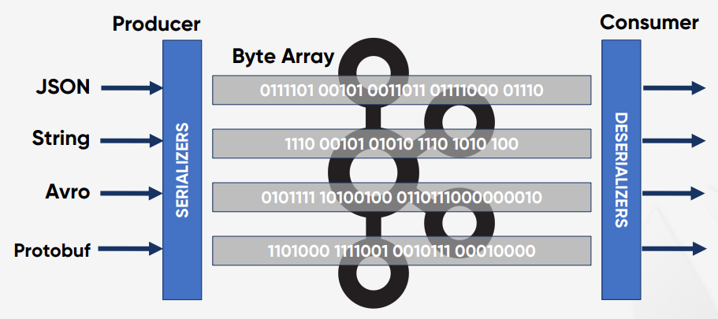

# Producer
Apache Kafka의 주요 요소는 Producer, Consumer, Consumer Group으로 그 중에서 `Producer`에 대해 심도있게 알아보자.  


* Producer : 메시지를 생산(Produce)해서 Kafka의 Topic으로 메시지를 보내는 애플리케이션이나 컴포넌트를 의미.
* Consumer : Topic의 메시지를 가져와서 소비(Consume)하는 애플리케이션이나 컴포넌트를 의미.
* Consumer Group : Topic의 메시지를 사용하기 위해 협력하는 Consumer들의 집합
* 하나의 Consumer는 하나의 Consumer Group에 포함되며, Consumer Group내의 Consumer들은 협력하여 Topic의 메시지를 병렬 처리한다.

전체적인 구조를 다시 한번 살펴보자.

<br>

## Producer와 Consumer의 분리(Decoupling)
### Producer와 Consumer의 기본 동작 방식  
  
* Producer와 Consumer는 분리되어 있어서 서로 알지 못하며, Producer와 Consumer는 각각 고유의 속도로 Commit Log에 Write 및 Read를 수행한다.
* 다른 Consumer Group에 속한 Consumer들은 서로 관련이 없으며, Commit Log에 있는 Event(Message)를 동시에 다른 위치에서 Read할 수 있다.

Commit Log에 있는 Message 구조를 살펴보자.

<br>

## Record(Message) 구조
### Header, Key, Value  
%20Structure.PNG)  

<br>

## Serializer/Deserializer
### To/From Byte Array
Kafka는 Record(데이터)를 Byte Array로 저장  
  

<br>

## Producer Sample Code
### Serializer
Key 와 Value 용 Serializer를 각각 설정, 보통 config 파일로 따로 관리  
```java
private Properties props = new Properties();

props.put(ProducerConfig.BOOTSTRAP_SERVERS_CONFIG, " broker101:9092,broker102:9092 ");
props.put(ProducerConfig.KEY_SERIALIZER_CLASS_CONFIG, org.apache.kafka.common.serialization.StringSerializer.class);
props.put(ProducerConfig.VALUE_SERIALIZER_CLASS_CONFIG, io.confluent.kafka.serializers.KafkaAvroSerializer.class);

KafkaProducer producer = new KafkaProducer(props);
```

<br>

## Producing to Kafka
### High-Level Architecture  
  

<br>

## Partitioner 의 역할
### 메시지를 Topic의 어떤 Partition으로 보낼지 결정  
  

<br>

## Partitioner 의 종류
### 성능, 작동 방식이 다양함
  

<br>

## Summary
### Message 구조, Serializer/Deserializer, Partitioner
* Message == Record == Event == Data
* Message는 Header 와 Key 그리고 Value 로 구성
* Kafka는 Record(데이터)를 Byte Array로 저장
* Producer는 Serializer, Consumer는 Deserializer를 사용
* Producer는 Message의 Key 존재 여부에 따라서 Partitioner를 통한 메시지 처리 방식이 달라진다