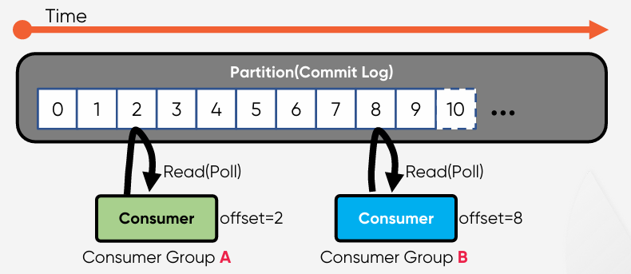
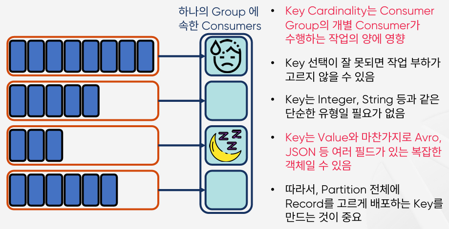

# Consumer
Kafka의 주요 요소 중 하나로 Consumer는 각각 고유의 속도로 Commit Log로부터 순서대로 Read(Poll)를 수행한다.  
다른 Consumer Group에 속한 Consumer들은 서로 관련이 없으며, Commit Log에 있는 Event(Message)를 동시에 다른 위치에서 Read할 수 있다.  

 

## Consumer Offset
중요한 개념 중 하나로 Consumer Group이 읽은 위치를 표시하는 정보이다.  
Consumer가 자동이나 수동으로 데이터를 읽은 위치를 commit하여 다시 읽음을 방지할 수 있다.  
`__consumer_offsets` 라는 Internal Topic에서 Consumer Offset을 저장하여 관리  

 

## Multi-Partitions with Single Consumer
### 모든 Partition에서 Consume  
4개의Partition으로 구성된 Topic의 데이터를 사용하는 Single Consumer가 있는 경우, 이 Consumer는 Topic의 모든 Partition에서 모든 Record를 Consume한다.  

 

## Consuming as a Group
### 동일한 group.id로 구성된 모든 Consumer들은 하나의 Consumer Group을 형성
* 4개의 파티션이 있는 Topic를 consume하는 4개의 Consumer가 하나의 Consumer Group에 있다면, 각 Consumer는 정확히 하나의 Partition에서 Record를 consume한다.
* Partition은 항상 Consumer Group내의 하나의 Consumer에 의해서만 사용된다.
* Consumer는 주어진 Topic에서 0개이상의 많은 Partition을 사용할 수 있다.  

 

## Multi Consumer Group
### Partition을 분배하여 Consume
* 동일한 `group.id`로 구성된 모든 Consumer들은 하나의 Consumer Group을 형성한다.
* Consumer Group의 Consumer들은 작업량을 어느 정도 균등하게 분할한다. 
* 동일한 Topic에서 consume하는 여러 Consumer Group이 있을 수 있다.

 

## Key를 사용하면
### Partition별로 동일한 Key를 가지는 메시지 저장
  

  

 

## Message Ordering(순서)
* Partition이 2 개 이상인 경우 `모든 메시지`에 대한 `전체 순서 보장 불가능`
* Partition을 1 개로 구성하면 모든 메시지에서 전체 순서 보장 가능 – `처리량 저하`
* `Partition을 1 개로 구성해서 모든 메시지에서 전체 순서 보장을 해야하는 경우가 얼마나 많을까? (사실 그렇게 많진 않지만 더 살펴보자)`

  

 

### 정확한 판단이 필요
* Partition을 1 개로 구성해서 모든 메시지에서 전체 순서 보장을 해야하는 경우가 얼마나 많을까?
* `대부분의 경우, Key로 구분할 수 있는 메시지들의 순서 보장이 필요한 경우가 많다.`

  

 

###  Key를 사용하여 Partition별 메시지 순서 보장
* 동일한 Key를 가진 메시지는 동일한 Partition에만 전달되어 Key 레벨의 순서 보장 가능– 멀티 Partition 사용 가능 = 처리량 증가
* `하지만 운영중에 Partition 개수를 변경하면 어떻게 될까? 순서 보장 불가`

  

 

## Cardinality
### 특정 데이터 집합에서 유니크(Unique)한 값의 개수

 

## Consumer Failure
### Consumer Rebalancing
* 4개의 파티션이 있는 Topic를 consume하는 4개의 Consumer가 하나의 Consumer Group에 있다면, 각 Consumer는 정확히 하나의 Partition에서 Record를 consume한다.
* Partition은 항상 Consumer Group내의 하나의 Consumer에 의해서만 사용된다.
* Consumer는 주어진 Topic에서 0개 이상의 많은 Partition을 사용할 수 있다.

 

* Consumer Group 내의 다른 Consumer가 실패한 Consumer를 대신하여 Partition에서 데이터를 가져와서 처리한다.
* Partition은 항상 Consumer Group내의 하나의 Consumer에 의해서만 사용된다.
* Consumer는 주어진 Topic에서 0개 이상의 많은 Partition을 사용할 수 있다.

 

## Summary
### Offset, Consumer Group, 순서 보장, Consumer Rebalancing
* Consumer가 자동이나 수동으로 데이터를 읽은 위치를 commit하여 다시 읽음을 방지할 수 있다
* __consumer_offsets 라는 Internal Topic에서 Consumer Offset을 저장하여 관리
* 동일한 group.id로 구성된 모든 Consumer들은 하나의 Consumer Group을 형성
* 서로 다른 Consumer Group의 Consumer들은 분리되어 각자 독립적으로 작동
* 동일한 Key를 가진 메시지는 동일한 Partition에만 전달되어 Key 레벨의 순서 보장 가능
* Key 선택이 잘못되면 작업 부하가 고르지 않을 수 있다
* Consumer Group 내의 다른 Consumer가 실패한 Consumer를 대신하여 Partition에서 데이터를 가져와서 처리할 수 있다