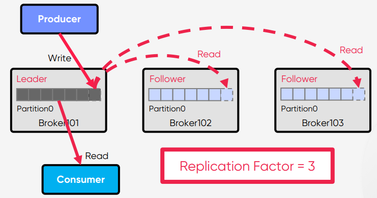

# Replication

 

## Broker에 장애가 발생하면 어떻게 될까?

 

## Partition 관련 데이터들
### Message, Offset
Producer가 Write하는 `LOG-END-OFFSET`과 Consumer Group의 Consumer가 Read하고 처리한 후에 Commit한 `CURRENT-OFFSET`과의 차이(`Consumer Lag`)가 발생할 수 있다.  

 

## 다른 Broker에서 Partition을 새로 만들 수 있으면 장애 해결할 수 있을까?
### 메시지(데이터) 및 Offset 정보의 유실은?
다른 Broker에서 장애가 발생한 Partition을 대신해서 Partition을 새로 만들면 장애를 해결할 순 있을 것이다.  
`하지만 기존 메시지는 버릴 것인가? 기존 Offset 정보들을 버릴 것인가?`  

 

## Replication(복제) of Partition
### 그래서 kafka에서는 장애를 대비하기 위한 기술로 Replication을 제공
말그대로 Partition을 미리 복제(Replication)하여 다른 Broker상에서 복제물(Replicas)을 만들어서 장애를 미리 대비한다.  
`Replicas - Leader Partition, Follower Partition`

 

## Producer/Consumer는 Leader와만 통신
### Follower는 복제만
Producer는 Leader에만 Write하고 Consumer는 Leader로부터만 Read한다.  
Follower는 Broker 장애시 안정성을 제공하기 위해서만 존재한다.  
Follower는 Leader의 Commit Log에서 데이터를 가져오기 요청(Fetch Request)으로 복제  

 

## Leader 장애
### 새로운 Leader를 선출
Leader에 장애가 발생하면?  
Kafka 클러스터는 Follower 중에서 새로운 Leader를 선출  
Clients(Producer/Consumer)는 자동으로 새 Leader로 전환  

 

## Partition Leader에 대한 자동 분산
하나의 Broker에만 Partition의 Leader들이 몰려 있다면?  
특정 Broker에만 Client(Producer/Consumer)로 인해 부하 집중되어 문제가 발생할 확률이 높아진다.  
### `Hot Spot` 발생

 

### `Hot Spot` 방지
* `auto.leader.rebalance.enable` : 기본값 enable 
* `leader.imbalance.check.interval.seconds` : 기본값 300 sec
* `leader.imbalance.per.broker.percentage` : 기본값 10

 

## Rack Awareness
### Rack 간 분산하여 Rack 장애를 대비
동일한 Rack 혹은 Available Zone상의 Broker들에 동일한 `rack name` 지정  
복제본(Replica-Leader/Follower)은 최대한 Rack 간에 균형을 유지하여 Rack 장애 대비  
Topic 생성시 또는 Auto Data Balancer/Self Balancing Cluster 동작 때만 실행  

 

## Summary
### Replication, Rack Awareness
* Partition을 복제(Replication)하여 다른 Broker상에서 복제물(Replicas)을 만들어서 장애를 미리 대비할 수 있다.
* Leader Partition, Follower Partition를 묶어서 Replicas라고 부른다.
* Producer는 Leader에만 Write하고 Consumer는 Leader로부터만 Read할 수 있다.
* Follower는 Leader의 Commit Log에서 데이터를 가져오기 요청(Fetch Request)으로 복제한다.
* 복제본(Replica-Leader/Follower)은 최대한 Rack 간에 균형을 유지하여 Rack 장애 대비하는 Rack Awareness 기능이 있다.