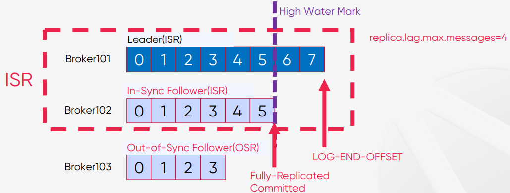
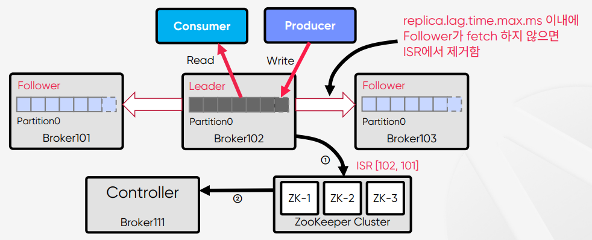
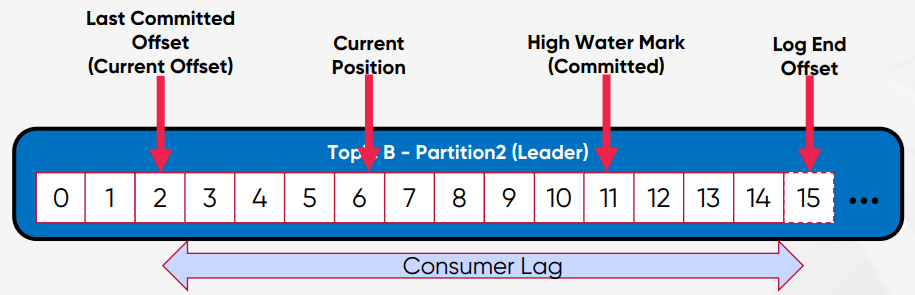
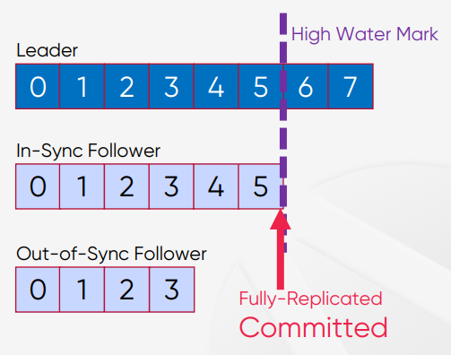
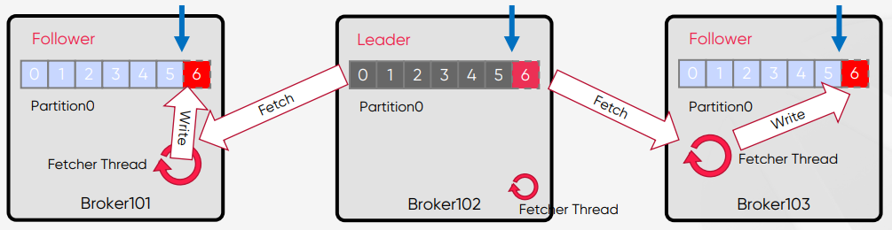
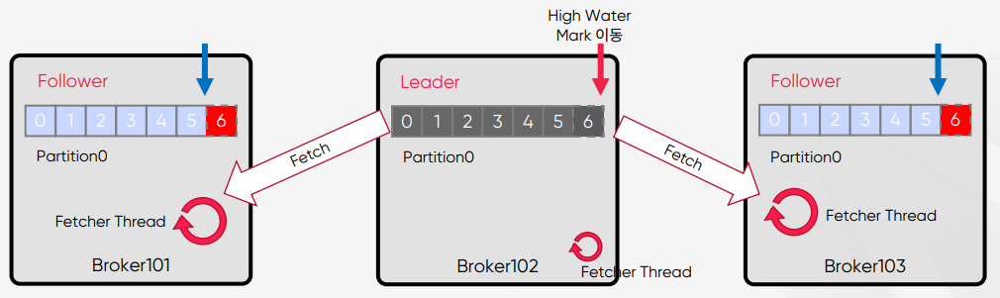
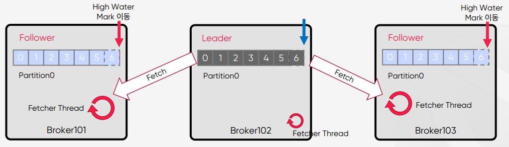

# In-Sync Replicas(ISR)
## Leader 장애시 Leader를 선출하는데 사용
In-Sync Replicas(ISR)는 High Water Mark라고 하는 지점까지 동일한 Replicas (Leader와 Follower 모두)의 목록을 말한다.  
Leader에 장애가 발생하면, ISR 중에서 새 Leader를 선출  

 

## replica.lag.max.messages 옵션 사용 시 문제점
### 메시지 유입량이 갑자기 늘어날 경우
`replica.lag.max.messages` 로 ISR 판단시 나타날 수 있는 문제점
* 메시지가 항상 일정한 비율(초당 유입되는 메시지, 3 msg/sec 이하 )로 Kafka로 들어올 때, `replica.lag.max.messages=5`로 하면 5 개 이상으로 지연되는 경우가 없으므로 ISR들이 정상적으로 동작한다.
* 메시지 유입량이 갑자기 늘어날 경우(예, 초당 10 msg/sec), 지연으로 판단하고 OSR(Out-ofSync Replica)로 상태를 변경시킨다.
* 실제 Follower는 정상적으로 동작하고 단지 잠깐 지연만 발생했을 뿐인데, `replica.lag.max.messages` 옵션을 이용하면 OSR로 판단하게 되는 문제가 발생 (운영중에 불필요한 error 발생 및 그로 인한 불필요한 retry 유발)

`replica.lag.time.max.ms`으로 판단해야 한다.
* Follower가 Leader로 Fetch 요청을 보내는 Interval을 체크
* 예) `replica.lag.time.max.ms = 10000` 이라면 Follower가 Leader로 Fetch 요청을 10000ms 내에만 요청하면 정상으로 판단한다.
* Confluent 에서는 `replica.lag.time.max.ms` 옵션만 제공(복잡성 제거)

 

## ISR은 Leader가 관리
### Zookeeper에 ISR 업데이트, Controller가 Zookeeper로부터 수신
1. Follower가 너무 느리면 Leader는 ISR에서 Follower를 제거하고 ZooKeeper에 ISR을 유지
2. Controller는 Partition Metadata에 대한 변경 사항에 대해서 Zookeeper로부터 수신

 

## Controller
## Kafka Cluster 내의 Broker중 하나가 Controller가 된다.
* Kafka Cluster 내의 Broker중 하나가 Controller가 된다.
* Controller는 ZooKeeper를 통해 Broker Liveness를 모니터링
* Controller는 Leader와 Replica 정보를 Cluster내의 다른 Broker들에게 전달
* `Controller는 ZooKeeper에 Replicas 정보의 복사본을 유지한 다음 더 빠른 액세스를 위해 클러스터의 모든 Broker들에게 동일한 정보를 캐시한다.`
* `Controller가 Leader 장애시 Leader Election을 수행`
* Controller가 장애가 나면 다른 Active Broker들 중에서 재선출된다.(ZooKeeper가 재선출)

 

## Consumer 관련 Position들
### Last Committed Offset, Current Position, High Water Mark, Log End Offset
* Last Committed Offset(Current Offset) : Consumer가 최종 Commit한 Offset
* Current Position : Consumer가 읽어간 위치(처리 중, Commit 전)
* High Water Mark(Committed) : ISR(Leader-Follower)간에 복제된 Offset
* Log End Offset : Producer가 메시지를 보내서 저장된, 로그의 맨 끝 Offset

 

## Committed의 의미
### ISR 목록의 모든 Replicas가 메시지를 받으면 “Committed”
* ISR 목록의 모든 Replicas가 메시지를 성공적으로 가져오면 “Committed”
* `Consumer는 Committed 메시지만 읽을 수 있다.`
* Leader는 메시지를 Commit할 시기를 결정한다.
* Committed 메시지는 모든 Follower에서 동일한 Offset을 갖도록 보장한다.
* `즉, 어떤 Replica가 Leader인지에 관계없이(장애 발생이라도) 모든 Consumer는 해당 Offset에서 같은 데이터를 볼 수 있다.`
* Broker가 다시 시작할 때 Committed 메시지 목록을 유지하도록 하기 위해, Broker의 모든 Partition에 대한 마지막 Committed Offset은 replicationoffset-checkpoint라는 파일에 기록된다.

 

## Replicas 동기화
### High Water Mark, Leader Epoch
High Water Mark
* 가장 최근에 Committed 메시지의 Offset 추적하기 위한 옵션
* replication-offset-checkpoint 파일에 체크포인트를 기록된다.

Leader Epoch
* 새 Leader가 선출된 시점을 Offset으로 표시
* Broker 복구 중에 메시지를 체크포인트로 자른 다음 현재 Leader를 따르기 위해 사용된다.
* Controller가 새 Leader를 선택하면 Leader Epoch를 업데이트하고 해당 정보를 ISR 목록의 모든 구성원에게 보낸다.
* leader-epoch-checkpoint 파일에 체크포인트를 기록

 

## Message Commit 과정
### Follower에서 Leader로 Fetch만 수행
1. Offset 5 까지 복제가 완료되어 있는 상황에서, Producer가 메시지를 보내면 Leader가 offset 6 에 새 메시지를 추가  

 

2. 각 Follower들의 Fetcher Thread가 독립적으로 fetch를 수행하고, 가져온 메시지를 offset 6 에 메시지를 Write  

 

3. 각 Follower들의 Fetcher Thread가 독립적으로 다시 fetch를 수행하고 null 을 받는다.  
   Leader는 High Water Mark 이동  

 

4. 각 Follower들의 Fetcher Thread가 독립적으로 다시 fetch를 수행하고 High Water Mark를 받는다.  

 

## Summary
### ISR, Committed, High Water Mark, Controller
* In-Sync Replicas(ISR)는 High Water Mark라고 하는 지점까지 동일한 Replicas(Leader와 Follower 모두)의 목록을 뜻한다.
* High Water Mark(Committed) : ISR(Leader-Follower)간에 완벽하게 복제된 Offset의 위치를 뜻한다.
* Consumer는 Committed 메시지만 읽을 수 있다.
* Kafka Cluster 내의 Broker중 하나가 Controller가 된다.
* Controller는 ZooKeeper를 통해 Broker Liveness를 모니터링를 하고 정보를 갖은 다음에 전체 Broker쪽으로 다시 데이터를 Sync시켜주는 동작을 한다.