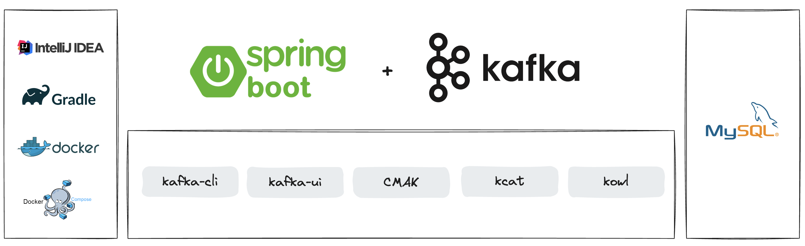
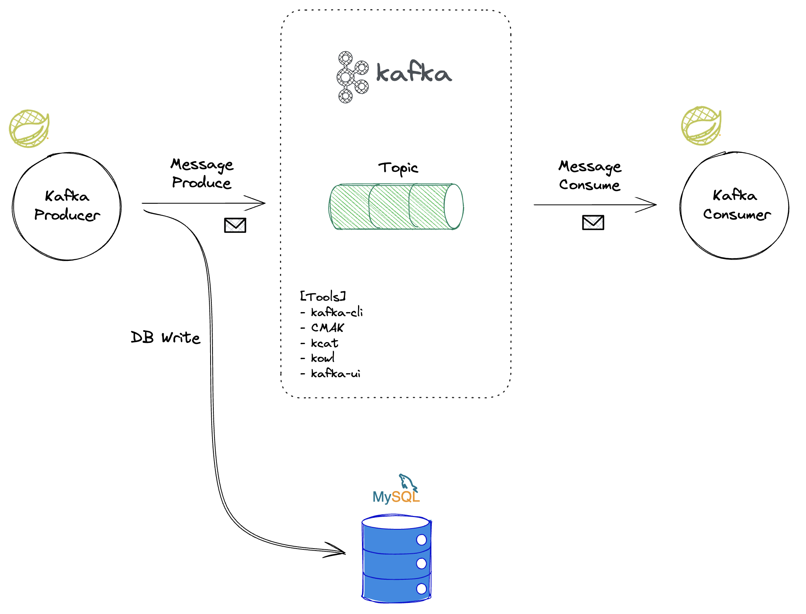
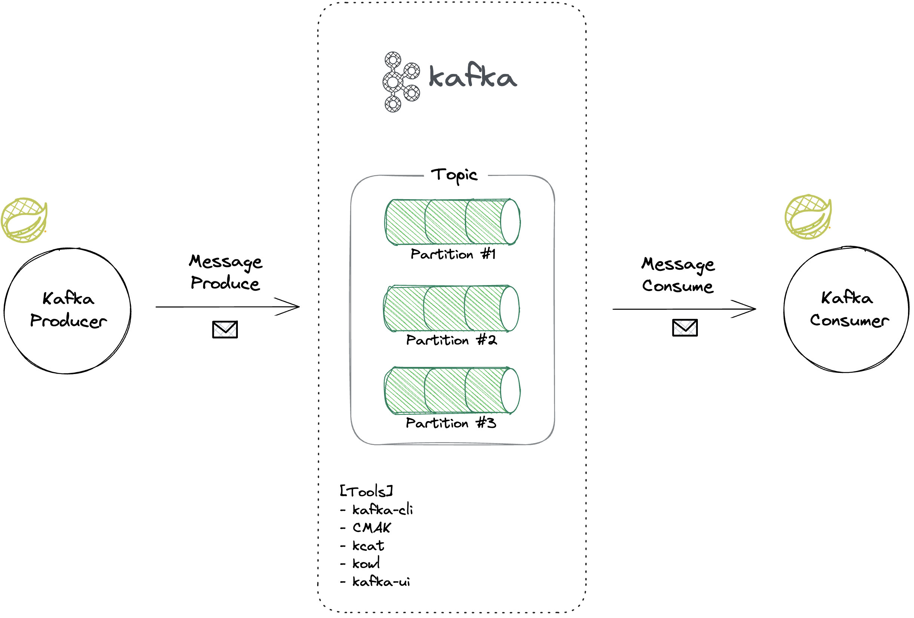
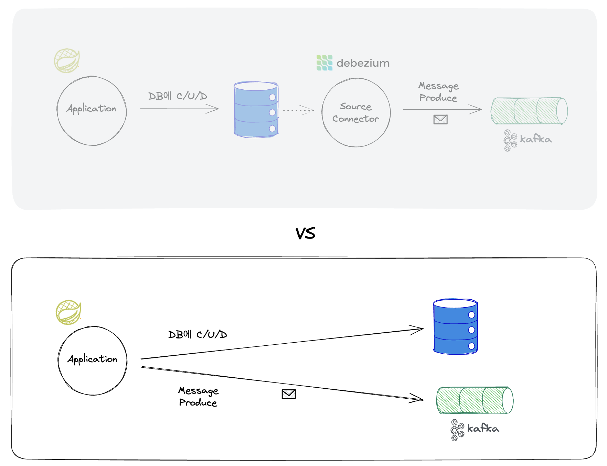
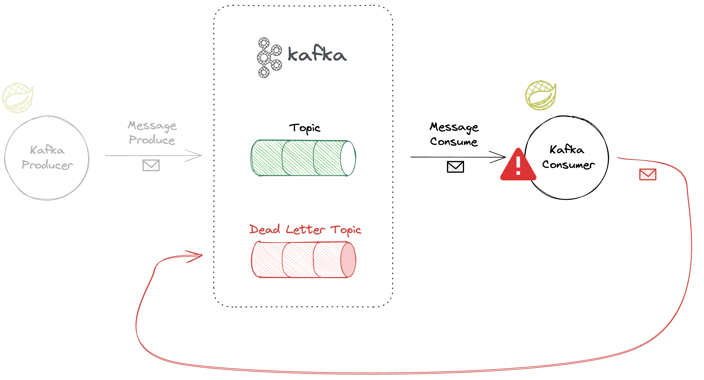

# 백엔드 개발자의 메시징큐




**Kafka라는 Messaging Queue 플랫폼을 주제로, 백엔드 개발자가 실무에서 Kafka를 사용하기 위해 Producer/Consumer 차원의 기본적인 활용 방법, 이슈 대응 방법 등을 학습하기 위한 프로젝트입니다.**

## 주요하게 사용되는 기술 스택

* Kafka
* Spring Boot
* Java 17
* Spring Data JPA
* Mysql
* Gradle
* Docker
* Docker Compose

### 그 외 사용되는 기술들
- kafka-cli
- CMAK
- kcat
- Redpanda Console(구 Kowl)
- kafka-ui
- spring-kafka
- spring-cloud-stream

## 이해를 돕기 위한 그림

* 
* 
* 

## Execution

```
docker compose up -d
```

## Endpoints
- Tomcat Server
  - http://localhost:8080
  - Swagger UI: http://localhost:8080/swagger-ui/index.html
- Kafka
  - http://localhost:9092, http://localhost:9093, http://localhost:9094
- Zookeeper
  - http://localhost:2181
- Kafka UI
  - http://localhost:8081
- CMAK
  - http://localhost:9000
- Redpanda Console(구 Kowl)
  - http://localhost:8989
- Mysql
  - http://localhost:3306
  - root password: `1234`
  - database: `campus`
  - User/PW: `myuser`/`mypassword`

## Course Information

* Title: 백엔드 개발자의 메시징큐
* Instructor: 한현상님
* Platform: Fast Campus
* Link: [한번에 끝내는 Kafka Ecosystem](https://fastcampus.co.kr/dev_online_newkafka)