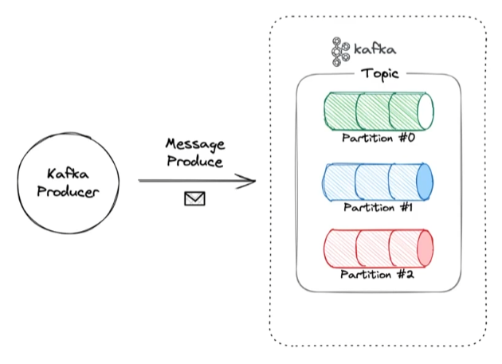
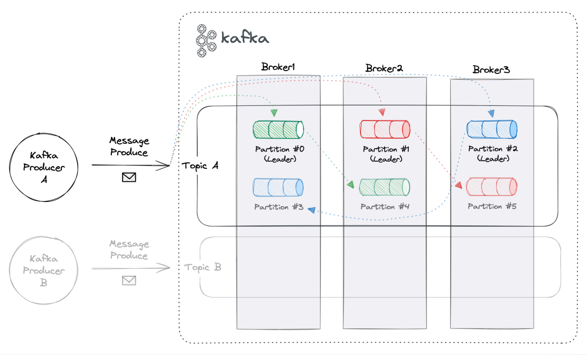

# Kafka CLI 둘러보기

<br>

## Kafka-cli의 주요 커맨드 도구
Kafka-cli라는 도구는 특별하게 독립적인 도구는 아니고, Kafka를 다운받으면 그 안에 포함되어 있는 커맨드 라인 인터페이스이다.  
목적에 따라서 커맨드들이 그룹핑이 되어있다.

* 대표적으로 많이 사용하는 커맨드
  * `kafka-topics.sh` : topic CRUD
    * **--create** : topic 생성
    * **--alter** : topic 옵션 수정
    * **--list** : topic 목록 조회
    * **--describe** : topic 상세 정보 조회
    * **--delete** : topic 삭제
  * `kafka-console-producer.sh` : 개발자가 producer 역할이 되어서 cli를 통해서 메시지를 생성할 수 있다.
  * `kafka-console-consumer.sh` : 개발자가 consumer 역할이 되어서 cli를 통해서 메시지를 조회할 수 있다. 
  * `kafka-consumer-groups.sh` : kafka로부터 topic을 consume하는 consumer group들에 대한 정보를 조회할 수 있다. 
    * **--list**

    
* 실습 예시
  * docker compose를 사용하여 특정 컨테이너를 대상으로 특정 명령어를 실행할 수 있다.  
    `docker compose exec {컨테이너 서비스명} {명령어}` 
  ```shell
  docker compose exec kafka1 \ 
         kafka-topics.sh\
           --bootstrap-server localhost:9092, localhost:9093, localhost:9094 \ 
           --create --topic my-topic\
           --replication-factor 2 \
           --partitions 1
  ```
    * **--bootstrap-server** : kafka broker 접속 정보 작성(1개만 작성해도 kafka 클러스터에 접근하는 데 문제 없다.)
    * **--create --topic** : topic 이름 작성
    * **--replication-factor**
      * 1 : kafka 메시지를 따로 복제하지 않고, 데이터를 하나만 사용(원본 데이터)
      * 2 : 메시지를 복제하여 사용(원본 + 복제본)
    * **--partitions** : partition 수는 한번 늘리면 줄일 수 없기 때문에 신중히 결정해야 한다.(늘리는건 가능)
      * 1 : topic을 한 통(하나의 큐)처럼 사용
      * N : topic을 N등분해서 N개의 큐로 쪼개서 사용, kafka를 데이터가 지나가는 톨게이트로 비유하면 톨게이트 개수를 정하는 것.

<br>

## 예시 1 - 토픽에 메시지 프로듀스
Kafka-cli에서 확인 할 내용은 결국 단순화 했을 때, 아래의 그림과 같다.


실습을 위해 Message를 담을 Topic을 Kafka에 생성해보자.  
원활한 실습을 위해 콘솔창은 3개를 띄워두자.(topics/producer/consumer)
1. docker compose 명령어
   * 컨테이너 실행 : `docker compose up -d`, docker desktop에서 시각화하여 확인 가능하고, 로그도 컨테이너 단위로 확인 가능하다.
2. Kafka Topics 명령어
   * ```shell
     docker compose exec kafka1 \ 
            kafka-topics.sh --create --topic my-topic \
            --bootstrap-server localhost:19092 \ 
            --replication-factor 1 \
            --partitions 1
     ```
     * 가장 기본 형태의 topic 생성
3. Consumer 명령어
   * ```shell
     docker compose exec kafka1
            kafka-console-consumer.sh --bootstrap-server localhost:19092 \
            --topic my-topic
            --from-beginning
     ```
     * **--from** : 읽어올 데이터 지정, 해당 예시에서는 처음부터(**-beginning**)
4. Producer 명렁어
   * ```shell
     docker compose exec kafka1 
            kafka-console-producer.sh --bootstrap-server localhost:19092
            --topic my-topic
     ``` 
     * **--topic my-topic** : 메시지를 발행할 topic 지정
   * ```shell
     > 1st
     > 2nd
     > 3rd
     > 4th
     > 5th
     ```
     * 메시지를 발행하면 consumer가 실행되고 있는 콘솔창에서 메시지 확인 가능

<br>

## 예시 2 - 파티션이 나뉘어 있는 토픽에 메시지 프로듀스(파티셔닝; partitioning)




1. Kafka Topics 명령어
   * 토픽 생성 시 partition의 개수를 지정할 수 있지만, 실습차원에서 `kafka-topics.sh` 커멘더 옵션 중의 `alter` 옵션을 사용하여 기존 토픽의 partitions 수 변경으로 진행
   * ```shell
     docker compose exec kafka1 \ 
            kafka-topics.sh --topic my-topic \
            --bootstrap-server localhost:19092 \
            --alter --partitions 3
     ```
2. Consumer 명령어
   * ```shell
     docker compose exec kafka1
            kafka-console-consumer.sh --bootstrap-server localhost:19092
            --topic my-topic
            --from-beginning
     ```
3. Producer 명렁어
   * ```shell
     docker compose exec kafka1 
            kafka-console-producer.sh --bootstrap-server localhost:19092
            --topic my-topic
            --property="parse.key=true"
            --property="key.separator=:"
     ``` 
        * **--property="parse.key=true"** : key parsing을 true로 지정, 메시지 발행 시 키도 작성해주어야 한다.
        * **--property="key.separator=:"** : key separator를 `:` 으로 지정
   * ```shell
     > 1:1st
     > 2:2nd
     > 3:3rd
     > 4:4th
     > 5:5th
     > 6:6th
     > 7:7th
     > 8:8th
     > 9:9th
     > 10:10th
     ```
        * `:` 의 앞은 key고 뒤는 message
        * 메시지를 발행하면 consumer가 실행되고 있는 콘솔창에서 메시지 확인 가능
        * message만 확인 가능하고, 키는 내부의 메타정보로 저장

<br>

### 메시지에 키를 왜 지정하는 걸까?
사실 위의 그림은 개념적이고 논리적인 모습이고, 실제로는 아래의 그림과 같이 구성되어 있다.  
topic은 사실 kafka 메시지들에 대한 논리적인 그룹핑 단위로, 실제로 물리적으로는 broker라는 곳에 담겨있다.

.PNG)

`broker`은 하나하나의 kafka 머신이라고 이해하면 된다.  
broker라는 것은 하나의 클러스터를 구성하고 있으면, topic이라는 논리적인 단위가 그것을 가로지르고 partition들을 하나의 그룹으로 묶어주고 있다.

해당 예시에서 partition을 3개로 운영하기로 한만큼 하나의 broker에 3개의 partition을 다 담을 필요는 없다.  
마침 broker가 3개니까 세 군데에 나눠서 담아두면 우리가 사용할 리소스를 최대한 골고루 사용할 수 있기 때문에 나눠서 담아두는 게 일반적이다.  

그런데 kafka는 큐이기에 순서보장이 중요한 미션이다.  
kafka는 원칙적으로 topic내에서 partition이 하나로 운영 될 경우에만 순서보장이 되고, partition이 두 개 이상인 경우에는 순서보장이 되지 않는다.  
간단히 예를 들어서 화장실의 한줄 서기는 순서보장이 가능하지만, 각자 2대의 차를 타고 차선이 3개인 도로를 달려 목적지를 향한다면 먼저 출발한 차가 먼저 도착하리라는 보장이 없는 것과 같다.  

그래서 kafka는 토픽이 아니라, 토픽의 세분화된 단위인 partition 단위로 순서 보장을 하게 된다.  
이러한 순서 보장을 하기 위해서 각 메시지가 어떤 partition을 찾아가야 하는지 mapping을 해주는 key가 바로 실습에서 진행한 key이다.  
key를 가지고 hash 로직을 돌려서, 그 결과값으로 partition과 매칭을 해준다.  
hash라는 것의 특성상 어떤 값이 input으로 들어가면 output이 반환되는데, 똑같은 input이 들어가면 똑같은 output을 반환하기 때문에 동일한 key를 가진 메시지는 동일한 파티션을 항상 찾아가게 되고, partition 나뉘어져있는 토픽에서도 결과적으로 순서 보장이 되는 것이다.

다시 실습으로 돌아가서 `특정 partition만 consuming`해서 메시지를 확인해보자.
* Consumer 명령어
   * ```shell
     docker compose exec kafka1
            kafka-console-consumer.sh --bootstrap-server localhost:19092
            --topic my-topic
            --from-beginning
            --partition 1
     ```
     * **--partition** : 특정 partition에 대해서만 메시지 조회
   * 조회한 메시지의 키를 확인하여, 특정 partition과 매칭된 키를 확인할 수 있다.

<br>

## 예시 3 - 파티션이 나뉘어 있는 복제된 토픽에 메시지 프로듀스(리플리케이션; replication)



1. Kafka Topics 명령어
   * ```shell
     docker compose exec kafka1 \ 
            kafka-topics.sh --create --topic my-distributed-topic \
            --bootstrap-server localhost:19092 \
            --replication-factor 2 \
            --partitions 3
     ```
     * **--replication-factor 2** : 하나는 원본, 하나만 복제해서 총 2쌍을 가지겠다는 설정
   * topic list 확인(**--list**)
     * ```shell
       docker compose exec kafka1 \ 
              kafka-topics.sh --list \
              --bootstrap-server localhost:19092
       ```
   * 실습이 끝난 topic 삭제(**--delete**)
     * ```shell
       docker compose exec kafka1 \ 
              kafka-topics.sh --delete --topic my-topic \
              --bootstrap-server localhost:19092
       ```
2. Consumer 명령어
   * ```shell
     docker compose exec kafka1
            kafka-console-consumer.sh --bootstrap-server localhost:19092
            --topic my-distributed-topic
            --from-beginning
     ```
3. Producer 명렁어
   * ```shell
     docker compose exec kafka1 
            kafka-console-producer.sh --bootstrap-server localhost:19092
            --topic my-distributed-topic
            --property="parse.key=true"
            --property="key.separator=:"
     ``` 
   * ```shell
     > 1:1st
     > 2:2nd
     > 3:3rd
     > 4:4th
     > 5:5th
     > 6:6th
     > 7:7th
     > 8:8th
     > 9:9th
     > 10:10th
     ```

<br>

사실 리플리케이션을 한다고 해도 백엔드 개발자의 입장에서는 달라지는 점을 체감하기 어렵다.

위의 그림을 보며 리플리케이션을 하는 이유에 대해 알아보자.  
위의 그림처럼 메시지가 들어오면 partition 0,1,2중에서 key를 보고 어디로 찾아갈지 결정하게 된다.  
key에 따라서 메시지가 찾아가는데, 항상 맨 윗줄에 있는 partition으로만 찾아간다.  
이러한 partition을 `leader partition`이라고 한다.  
외부와 직접적으로 메시지를 주고 받는 partition을 leader partition이라고 하고, 아래의 같은 색의 partition은 leader partition과 똑같은 데이터를 갖고있는데 이러한 partition은 `follower partition`이라고 한다.  
follower partition은 leader partition으로부터 데이터를 옮겨 받는다.  
즉, 메시지 프로듀스가 되면 partition을 찾아갈때는 항상 leader partition을 찾아가게 되고, leader에서 follower로 그 데이터를 복제해주는 것이다.

위의 그림을 보면 동일한 색상의 partition이 동일한 broker에 담겨있지 않고 크로스되어서 담겨있는데, 이렇게 되면 하나의 broker가 down되어도 다른 broker에서 data를 가지고있기 때문에 복구가 용이하다.  
그래서 kafka의 특징을 `고가용성`이라고 하는 것이다.  
follower partition은 backup용이라고 기억하면 기억하기 쉽다.