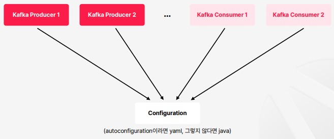

# spring-kafka와 spring-cloud-stream 소개

Java/SpringBoot 환경에서 Kafka를 사용하기 위해서는 kafka-clients 등 다른 방법도 있겠지만, 대표적으로 spring-kafka 또는 spring-cloud-stream을 많이 사용한다.

 

## spring-kafka 느낌 보기
  
실제로는 해당 그림보다는 구체적인 의도들로 이루어져 있지만, 대략 spring-kafka와 spring-cloud-stream의 개념적 차이를 보기위해서 단순화한 그림이다.  
기본적인 구성으로는 Configuration 파일을 하나 만들어 놓고, 여러 Producer나 Consumer가 있어도 하나의 Configuration 파일을 바라보고 동작을 하는 방식이다.  

### 만약에 Configuration이 하나 더 늘어나야하는 경우는?  

Kafka Consumer 1과 Kafka Consumer 2가 읽어오는 데이터 타입이나 Consumer 설정 값이 다를 경우에 아래의 그림처럼 Configuration 클래스를 필요에 따라 여러 개 더 구성할 수 있다.  
따라서 기본적으로는 하나의 설정파일을 재활용하는 방식인데, 필요하면 더 만들어서 세분화를 해나가는 방식이 spring-kafka의 전반적인 흐름이다.  

 

## spring-cloud-stream 느낌 보기
반면에 spring-cloud-stream은 하나의 큰 Configuration을 만들어두고, 설정과 비즈니스 파일이 완전히 분리되어 있는 형태를 띄고 있다.  
하나의 Configuration 파일 안에 Producer와 Consumer마다 각각 세부적으로 설정 할 수 있다.  
물론 이처럼 세분화해서 설정을 제공한다고 해도 공통화된 영역도 있다.  

 

## 특징 비교
  
의존성을 집합으로 표현한다면 kafka-clients가 spring-kafka안에 있고, spring-kafka도 spring-cloud-stream안에 있는 형태이다.  

추상화 레벨은 spring-kafka는 kafka만을 다루기 위해 spring의 기능들을 제공하고 있고, spring-cloud-stream은 kafka만 대상으로 만든 기술은 아니다. kafka 외의 메시징 큐들에 대해서도 기능을 제공한다.  
따라서 spring-cloud-stream은 kafka와 관련된 용어보다는 messaging Queue에 초점을 맞춘 일반화된 용어들을 많이 사용한다.  
예를 들어서 kafka에서는 topic이라고 하는 용어를 destination라고 표현을 한다.  

spring-cloud-stream을 통해서 kafka를 사용하다가 kafka가 아니라 다른 메시징 큐 시스템으로 바꾸려면 코드 변경은 거의 없이 설정 변경만으로 변경할 수 있다.  

성향별 추천은 kafka 지향적으로 직관적으로 사용하길 원하고, 커스터마이징이 필요없고 하나의 완성도 높은 설정 파일을 만들어놓고 똑같이 재활용해 갖다쓰고 싶다면 spring-kafka를 통해서 개발하는 것이 좋다.  
반대로 커스터마이징이 중요하다면 spring-cloud-stream을 사용하는 것이 좋다. 왜냐하면 spring-kafka로 커스터마이징을 하려면 많은 설정파일이 필요하여 작업량도 많아져서 비효율적이기 때문이다.