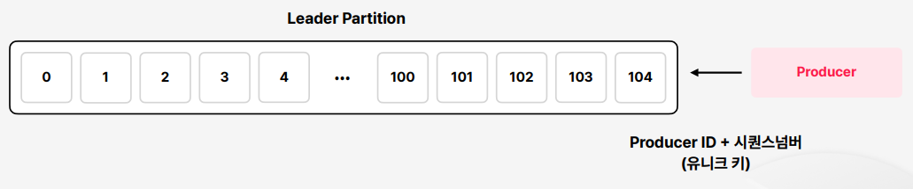

# Exactly Once Semantics(EOS)
EOS (Exactly Once Semantics)는 메시지 전송에서 메시지가 한 번만 전송되고 처리되는 것을 보장하는 전송 보증을 말한다.  
다시 말해, 송신자와 수신자 사이에 데이터의 중복 또는 손실 없이 데이터가 한 번만 전송되는 것을 의미한다.  
이전에는 Consumer 입장의 메시지 중복과 누락을 다뤘다면, EOS는 Producer 입장에서 중복과 누락을 방지하고자 사용하는 실시간 미션 크리티컬 스트리밍 애플리케이션이다.

<br>

## EOS가 필요해지는 이유
Producer가 Retry를 할 수 있기 때문이다.  

* `acks 0` : Producer가 메시지를 전달하고 끝나기 때문에 retry를 하지 않는다. 
* `acks 1` : Leader partition이 응답을 해줘야 Producer가 안심을 하게 되는데, 응답이 없다면 retry를 해서 메시지를 다시 한번 전달한다.
  * 이처럼 retry를 하게 되면 Producer 차원에서 중복이 발생할 수 있다. 
* `acks -1(all)` : `acks` 옵션을 `all`로 설정하게 되면 retry 할 일이 더 자주 생긴다. 그래서 Producer 측에서 중복이 발생할 수 있기때문에 EOS가 필요해진다. 

<br>

## EOS가 중복 또는 손실 Produce를 보증하는 방법



`Header`에 `Producer ID`와 `시퀀스 넘버`를 같이 넘긴다.  
Producer Id는 Producer마다 동일하게 갖고 있고, 시퀀스 넘버는 각 메시지마다 다른 시퀀스 넘버를 가지고 Partition에 들어가게 된다.  
결국 `Producer Id`와 `시퀀스 넘버`를 조합하면 하나의 `유니크 키`가 된다.  
이 유니크 키를 기준으로 Partition은 동일한 메시지를 구분할 수 있게 된다.

<br>

## 애플리케이션 적용
EOS를 적용하려면 필연적으로 acks 옵션이 all이어야 한다.  
왜냐하면 단 한번만 발송이 되어야 하는데, all이 아니면 Follow Partition까지 모두 메시지가 잘 전달이 되었는지 보장할 수 없기 때문이다.  
```yaml
#application.yml
acks: -1
```

<br>

그 이후에 중복으로 메시지를 보내도 받는 측에서 중복을 걸러 받을 수 있도록 해야 한다.
```java
//KafkaConfig.java / producerFactory()
props.put(ProducerConfig.ENABLE_IDEMPOTENCE_CONFIG, "true"); // EOS 적용
```